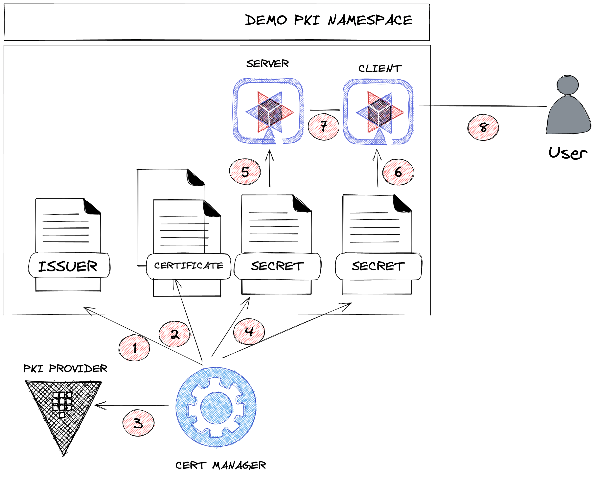

# EMEA Unconference 2021 - Cloud Native Certificate Management with JetStack
# Environment Setup

Follow the [environment setup](env/README.md) instruction.
# Quarkus Mutual TLS with Cert Manager and Vault PKI
## Getting Certificate From PKI Provider


1. Create issuer.
2. Watch certificates.
3. Request certificates to Vault PKI.
4. Get certificate and create Kubernetes secrets.
5. Mount certificate in client application.
6. Mount certificate in server application.
7. Client-Server connection with  mTLS.
8. Access client exposed application.
## Local Deployment

### Build

* JVM 
  ```
  mvn clean package -Dquarkus.profile=dev
  ```
* Native
  ```
  mvn clean package -Pnative -Dquarkus.profile=dev
  ```

### Run OpenShift
  ```
  mvn oc:build oc:resource oc:apply
  ```
