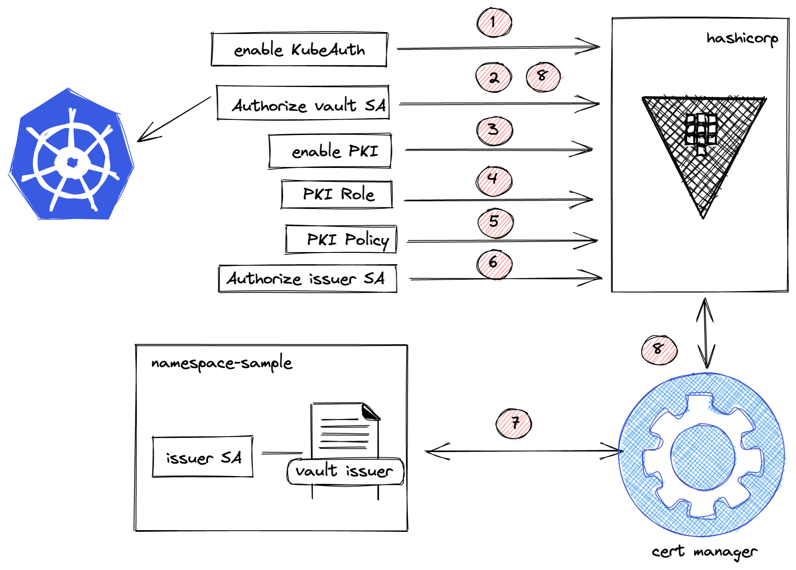

# Environment Setup

## Prerequisites

>
> Requires Helm v3 installed > https://helm.sh/docs/intro/install/
>

>
> Requires vault > https://www.vaultproject.io/downloads
>

## Cert Manager Installation

1. Create OpenShift Project.

    `oc new-project cert-manager`

2. Add jetstack helm repository.

    ```bash
    helm repo add jetstack https://charts.jetstack.io
    helm repo update
    ```
3. Launch the helm installation

    ```bash
    helm upgrade --install \
        cert-manager jetstack/cert-manager \
        --namespace cert-manager \
        --version v1.5.4 \
        --set installCRDs=true
    ```
4. Test the installation

    ```
    oc apply -f test/test-resource.yaml -n cert-manager
    ```

## Hashicorp Vault Installation

1. Configure Helm Repository

    ```
    helm repo add hashicorp https://helm.releases.hashicorp.com
    helm search repo hashicorp/vault
    ```

2. Install Vault

    ```
    oc new-project hashicorp
    helm install vault hashicorp/vault -f vault/standalone.yaml
    ```

3. Init Vault and Unseal

    ```
    oc rsh vault-0
    vault operator init -key-shares=1 -key-threshold=1

    Unseal Key 1: xxx
    Initial Root Token: xxx

    export KEYS=xxx
    export VAULT_TOKEN=xxx

    vault operator unseal $KEYS
    ```

## Cert Manager and Vault PKI Integration



1. Setup PKI engine for each environment

    >
    > Unseal Vault before!!
    >

    ```
    export VAULT_ADDR=https://$(oc get route vault --no-headers -o custom-columns=HOST:.spec.host -n hashicorp)
    export VAULT_TOKEN=xxx

    export PROJECT=app-dev
    export WILDCARD=vault.apps.cluster-7bcd.7bcd.sandbox334.opentlc.com

    sh vault/pki/setup.sh ${PROJECT} ${WILDCARD}
    ```

2. Configure SA issuer on the target project.

   ```
   helm upgrade --install ${PROJECT} vault/issuer -n ${PROJECT}
   ```
 
3. Install Issuer

    ```
    helm upgrade --install ${PROJECT} issuer -n ${PROJECT} --set issuer.create=true
    ```

4. Verify Dummy Certificate Secret is created

    ```
    oc get secret vault-issuer-dummy-cert -n ${PROJECT}
    ```